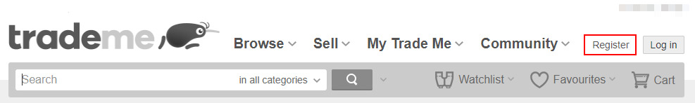
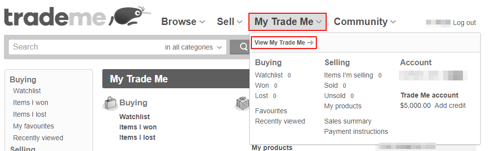
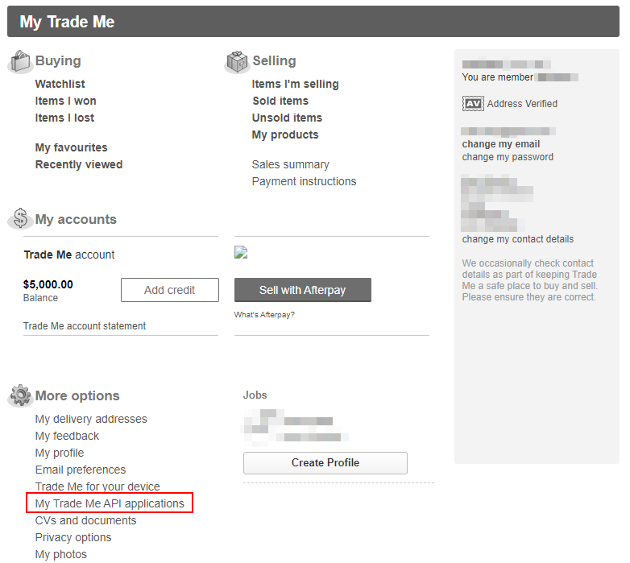
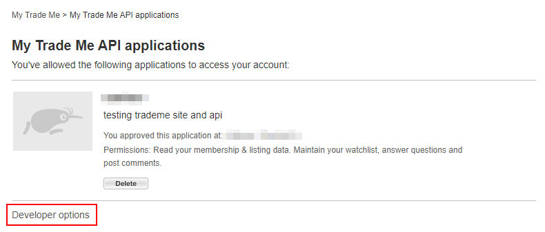

# Description
These are tests for Trade Me's website and services.

The tests are divided into two. A UI test suite that tests the [Trade Me website](https://www.tmsandbox.co.nz/), and an API test suite which test [Trade Me's services](https://developer.trademe.co.nz/api-overview/).

The tests are written on Python. It uses [requests](https://docs.python-requests.org/en/master) as the http client for testing the services and [selenium](https://github.com/SeleniumHQ/selenium/tree/trunk/py) for the website. Both are using [pytest](https://docs.pytest.org/en/latest) for the test framework.

# Prerequisites

## Python

You will need to have [Python](https://www.python.org/) installed (used v3.7.4) and have [Pipenv](https://pypi.org/project/pipenv/) installed to manage python packages and creating a virtual environment. Run the commands shown here from bash or shell.


## Pipenv

To install pipenv:
```bash
py -3.7 -m pip install pipenv
```

And set pipenv to create its virtual environment within the project itself by adding these to user's `PATH`:

`PIPENV_VENV_IN_PROJECT=1`

`PIPENV_VERBOSITY=-1`

## Webdriver

The UI tests requires the use of a web driver [chromedriver](https://chromedriver.chromium.org/) to run the UI tests. Make sure the chromdriver executable is added to `PATH`

## Application Accounts and Tokens

You will need to have a user created on the Trade Me sandbox and have generated OAuth tokens for the user to run these. You will then use these information for the environment variables as instrctured on the Test section.


### Create New User

Please go **[here to register and create a new user](https://www.tmsandbox.co.nz/Members/Register.aspx)** **OR** register from the main page.



And once you have created a new user and logged in, go to the users' **[My Trade Me API Application](https://www.tmsandbox.co.nz/MyTradeMe/Api/MyApplications.aspx)** **OR** open it from My Trade Me





Go to Developer options and then register a new application. Once you have created a new application, you should see your application from 'Developer options' with a **Consumer key** and a **Consumer secret**. You will then use this to generate an access token for the API.




### Generate Access Token

To make Trade Me API calls, you will need to to be a Trade Me member and obtain an Oauth token. To create one for yourself, use the access token generator from the **[Trade Me developer site](https://developer.trademe.co.nz/api-overview/authentication/)**.


Provide the consumer key and secret to generate the oauth token and secret.

You will then use and add all these information to your environment variables.

# Setup
Open the project from shell and create your virtual environment from the [Pipfile](Pipfile) on the main project folder. Run command
```bash
py -3.7 -m pipenv install
```

# Test
The tests involves logging in and providing authorisation tokens retreived from the environment variables. When running these tests from a build pipeline, add these to the pipeline environment variables.

To set this on your machine, you will need to add these environment variables with the corresponding value **OR** you can **use the two test commands provided below under the Run test section**.

```text
testuser=REPLACEWITHusername
testpassword=REPLACEWITHuserpassword
token=REPLACEWITHoauthtoken
tokensecret=REPLACEWITHoauthtokensecret
key=REPLACEWITHconsumerkey
keysecret=REPLACEWITHconsumersecret
```
## Run test

We use [pytest](https://pypi.org/project/pytest/) to run the tests. With pipenv, run the pytest command.

```bash
pipenv run python -m pytest -s --disable-warnings -v -n 2
```

For running the ui tests, use:
```bash
pipenv run python -m pytest -s --disable-warnings -v -n 2 -m ui
```

**to include the required environment variables from the command line:**
```bash
testuser=**REPLACEWITHusername** testpassword=**REPLACEWITHuserpassword** token=**REPLACEWITHoauthtoken** tokensecret=**REPLACEWITHoauthtokensecret** key=**REPLACEWITHconsumerkey** keysecret=**REPLACEWITHconsumersecret** pipenv run python -m pytest -s --disable-warnings -v -n 2 -m ui
```

For running the api tests, use:
```bash
pipenv run python -m pytest -s --disable-warnings -v -n 2 -m api
```

**to include the required environment variables from the command line:**
```bash
testuser=**REPLACEWITHusername** testpassword=**REPLACEWITHuserpassword** token=**REPLACEWITHoauthtoken** tokensecret=**REPLACEWITHoauthtokensecret** key=**REPLACEWITHconsumerkey** keysecret=**REPLACEWITHconsumersecret** pipenv run python -m pytest -s --disable-warnings -v -n 2 -m api
```
